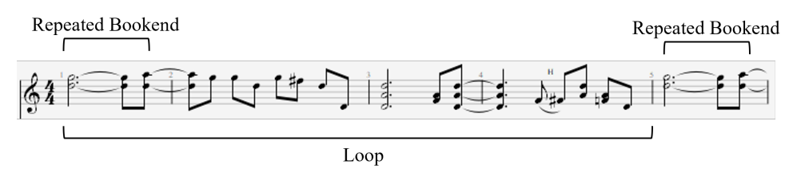

# GitHub Repository of Paper titled "The GigaMIDI dataset with loops and expressive music performance detection"
## Summary 
Research in artificial intelligence applications in music computing has gained significant traction with the progress of deep learning. Musical instrument digital interface (MIDI) data and its associated metadata are fundamental for the advancement of models that execute tasks such as music generation and transcription with optimal efficiency and high-performance quality. The majority of the public music datasets contain audio data, and symbolic music datasets are comparatively small. However, MIDI data presents advantages over audio, such as providing an editable version of musical content independent of its sonic rendering. MIDI data can be quantized or interpreted with variations in micro-timing and velocity, but there is only a limited amount of metadata and algorithms to differentiate expressive symbolic music data performed by a musician from non-expressive data that can be assimilated into music scores. To address these challenges, we present the GigaMIDI dataset, a comprehensive corpus comprising over 1.43M MIDI files, 5.3M tracks, and 1.8B notes, along with annotations for loops and metadata for expressive performance detection. To detect expressiveness, which tracks reflect human interpretation, we introduced a new heuristic called note onset median metric level (NOMML), which allowed us to identify with 99.5\% accuracy that 31\% of GigaMIDI tracks are expressive. Detecting loops, or repetitions of musical patterns, presents a challenge when tracks exhibit expressive timing variations, as repeated patterns may not be strictly identical. To address this issue, we mark MIDI loops for non-expressive music tracks, which allows us to identify 7M loops. The GigaMIDI dataset is accessible for research purposes on the Hugging Face hub [https://huggingface.co/datasets/h5ecv89/anon] in a user-friendly way for convenience and reproducibility.

## Repository Layout

[**/GigaMIDI**](./GigaMIDI): Code for creating the full GigaMIDI dataset from
source files, and README with example code for loading and processing the 
data set using the `datasets` library

[**/loops_nomml**](./loops_nomml): Source files for loop detection algorithm 
and expressive performance detection algorithm

[**/scripts**](./scripts): Scripts and code notebooks for analyzing the 
GigaMIDI dataset and the loop dataset

[**/tests**](./tests): E2E tests for expressive performance detection and 
loop extractions

## Running MIDI-based Loop Detection

Included with GigaMIDI dataset is a collection of all loops identified in the 
dataset between 4 and 32 bars in length, with a minimum density of 0.5 notes 
per beat. For our purposes, we consider a segment of a track to be loopable if 
it is bookended by a repeated phrase of a minimum length (at least 2 beats 
and 4 note events)



### Starter Code

To run loop detection on a single MIDI file, use the `detect_loops` function
```python
from loops_nomml import detect_loops
from symusic import Score

score = Score("tests\midi_files\Mr. Blue Sky.mid")
loops = detect_loops(score)
print(loops)
```

The output will contain all the metadata needed to locate the loop within the 
file. Start and end times are represented as MIDI ticks, and density is 
given in units of notes per beat:
```
{'track_idx': [0, 1, 1, 2, 2, 3, 3, 3, 3, 3], 'instrument_type': ['Piano', 'Piano', 'Piano', 'Piano', 'Piano', 'Drums', 'Drums', 'Drums', 'Drums', 'Drums'], 'start': [238080, 1920, 97920, 15360, 216960, 7680, 195840, 278400, 284160, 117120], 'end': [241920, 3840, 99840, 17280, 220800, 9600, 207360, 289920, 291840, 130560], 'duration_beats': [9.0, 5.0, 5.0, 5.0, 9.0, 5.0, 25.0, 25.0, 17.0, 29.0], 'note_density': [0.6666666666666666, 0.8, 0.8, 0.8, 0.8888888888888888, 0.8, 2.8, 2.36, 2.2941176470588234, 2.413793103448276]}
```

### Batch Processing Loops

We also provide a script, `main.py` that batch extracts all loops in a 
dataset. This requires that you have downloaded GigaMIDI, see the [dataset README](./GigaMIDI/README.md) for instructions on doing this. Once you have the dataset downloaded, update the `DATA_PATH` and `METADATA_NAME` globals to reflect the location of GigaMIDI on your machine and run the script:

```python
python main.py
```


## Instruction for using the code for note onset median metric level (NOMML) heuristic
### Install and import Python libraries for the NOMML code: <br /> 
Imported libraries: os, glob, json, random, numpy, tqdm, Pool, symusic (pip install required for numpy, tqdm and symusic) <br />
Note: symusic library is used for MIDI parsing.

### Using with the command line  <br />
usage: 
```python
python nomml.py [-h] --folder FOLDER [--force] [--nthreads NTHREADS]
```
<br />
Note: If you run the code succesfully, it will generate .JSON file with appropriate metadata.


## Analysis of Evaluation Set and Optimal Threshold Selection
The Analysis of Evaluation Set and Optimal Threshold Selection.zip archive contains CSV files corresponding to our training set, which were utilized to identify optimal thresholds for each heuristic in expressive music performance detection. These files include percentile calculations used to determine the optimal thresholds. The rationale behind employing percentiles from the data distribution is to delineate the boundary between non-expressive and expressive tracks based on the values of our heuristic features.


## Ethical Statement
The GigaMIDI dataset consists of MIDI files acquired via the aggregation of previously available datasets and web scraping from publicly available online sources. Each subset is accompanied by source links, copyright information when available, and acknowledgments. File names are anonymized using MD5 hash encryption. We acknowledge and cited the work from the previous dataset papers that we aggregate and analyze as part of the GigaMIDI subsets. 
This data has been collected, used, and distributed under Fair Dealing [ref to country and law copyright act anonymized]. Fair Dealing permits the limited use of copyright-protected material without the risk of infringement and without having to seek the permission of copyright owners. It is intended to provide a balance between the rights of creators and the rights of users.  As per instructions of the Copyright Office of [anonymized University], two protective measures have been put in place that are deemed sufficient given the nature of the data (accessible online):

  1) We explicitly state that this dataset has been collected, used, and is distributed under Fair Dealing [ref to law/country removed here for anonymity].
  2) On the Hugging Face hub, we advertise that the data is available for research purposes only and collect the user's legal name and email as proof of agreement before granting access.

We thus decline any responsibility for misuse. 

To justify the fair use of MIDI data for research purposes, we try to follow the FAIR (Findable, Accessible, Interoperable, and Reusable) principles in our MIDI data collection. These principles are widely recognized and frequently cited within the data research community, providing a robust framework for ethical data management. By following the FAIR principles, we ensure that our dataset is managed responsibly, supporting its use in research while maintaining high standards of accessibility, interoperability, and reusability.


In navigating the use of MIDI datasets for research and creative explorations, it is imperative to consider the ethical implications inherent in dataset bias. MIDI dataset bias often reflects the prevailing practices in Western contemporary music production, where certain instruments, notably the piano and drums, dominate due to their inherent MIDI compatibility. The piano is a primary compositional tool and a ubiquitous MIDI controller and keyboard, facilitating input for a wide range of virtual instruments and synthesizers. Similarly, drums, whether through drum machines or MIDI drum pads, enjoy widespread use for rhythm programming and beat production. This prevalence stems from their intuitive interface and versatility within digital audio workstations. Consequently, MIDI datasets tend to be skewed towards piano and drums, with fewer representations of other instruments, particularly those that may require more nuanced interpretation or are less commonly played using MIDI controllers.


A potential issue with the detected loops in the GigaMIDI dataset arises from the possibility that similar note content may appear, particularly in loop-focused applications. To mitigate this, we implemented an additional deduplication process for the detected loops. This process involved using MD5 checksums based on the extracted music loop content to ensure that identical loops are not provided to users.


Another potential issue with the dataset is the album-effect. When using the dataset for machine learning tasks, a random split may result in data with nearly identical note content appearing in both the evaluation and training splits of the GigaMIDI dataset. To address this potential issue, we provide metadata, including the composer's name, uniform piece title, performer’s name, and genre, where available. Additionally, the GigaMIDI dataset includes a substantial portion of drum grooves, which are single-track MIDI files; such files typically do not contribute to the album-effect.


Lastly, all source data is duly acknowledged and cited in accordance with fair use and ethical standards. More than 50% of the dataset was collected through web scraping and author-led initiatives, which include manual data collection from online sources and retrieval from Zenodo and GitHub. To ensure transparency and prevent misuse, links to data sources for each subset are systematically organized and provided in our GitHub repository, enabling users to identify and verify the datasets used.
# Acknowledgement
Anonymized during the peer review process for the paper.
